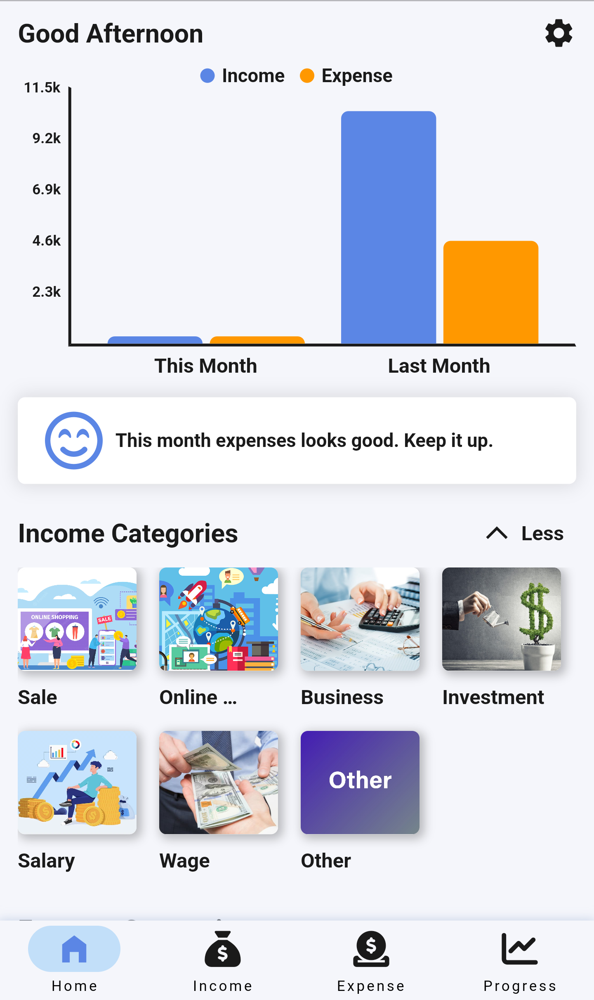
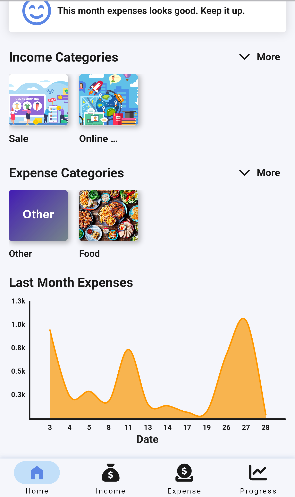

# Expense Tracker
A mobile app for tracking personal expenses and incomes.

# Technologies
1. Flutter
2. Node.js

# Features
1. Add expenses and incomes
2. Visualize expenses and incomes data from high amount to low amount 
3. Visualize expenses and incomes categories in pie chart 
4. Select dates to get the expenses and incomes between two particular days
5. Visualize current and last month expenses and incomes in bar chart 
6. Get feedback about whether the current month expenses looks good or bad
7. Visualize days expenses of last or current month in line chart
8. Get progress points and achievements after adding expenses and incomes
9. Share your progress points and achievements to the public
10. View progress points and achievements of top users in the raking system

# Future Work
1. Offline visualization
2. Dark mode

# Screenshots

